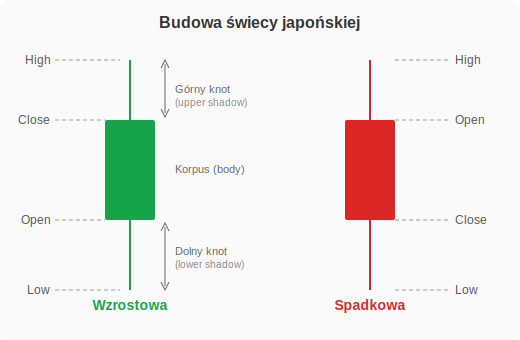

# Trade Docs — Kompendium wiedzy o tradingu

<!-- npx md-to-pdf trade-docs-pl.md -->

> Zbiór notatek edukacyjnych dotyczących tradingu, instrumentów finansowych
> (CFD, ETF, akcje, surowce) oraz praktycznych aspektów inwestowania
> na platformie XTB.

---

## Spis treści

### Część I — Podstawy

1. [Budowa świecy](#budowa-świecy)
2. [Co to jest wolumen?](#co-to-jest-wolumen)
3. [Co to jest spot?](#co-to-jest-spot)
4. [Co to jest spread?](#co-to-jest-spread)
   - [Jaki jest spread na metalach?](#jaki-jest-spread-na-metalach)
5. [Co to jest Open Interest, czyli liczba otwartych pozycji?](#co-to-jest-open-interest-czyli-liczba-otwartych-pozycji)
6. [CFD](#cfd)
   - [Co to jest pips / lot?](#co-to-jest-pips--lot)
   - [Co to jest lewar / dźwignia?](#co-to-jest-lewar--dźwignia)
7. [ETF](#etf)
   - [Co to jest ETF? Czym się różni od indeksu?](#co-to-jest-etf-czym-się-różni-od-indeksu)
   - [Co to jest iShares przy ETFach?](#co-to-jest-ishares-przy-etfach)
8. [Technika](#technika)
   - [Co to jest technika hedging?](#co-to-jest-technika-hedging)
9. [Rolowanie](#rolowanie)
   - [Jak działa rolowanie?](#jak-działa-rolowanie)
   - [Co to jest "contango" i "backwardation"?](#co-to-jest-contango-i-backwardation)
10. [Broker](#broker)
    - [Jaki broker?](#jaki-broker)
    - [Jaki broker jest najlepszy?](#jaki-broker-jest-najlepszy)
11. [Wyniki finansowe](#wyniki-finansowe)
    - [Jak się czyta wyniki finansowe?](#jak-się-czyta-wyniki-finansowe-jak-je-rozumieć-np-eps)
    - [Dlaczego gdy są dobre wyniki to spółka nie rośnie?](#dlaczego-gdy-są-dobre-wyniki-finansowe-to-spółka-nie-rośnie-np-duolingo)
12. [Makler](#makler)
    - [Kto to jest?](#kto-to-jest)
    - [Jak można nim zostać?](#jak-można-nim-zostać)
13. [Pre-market i after-market](#pre-market-i-after-market)
    - [Zalety handlu w pre/after-market](#zalety-handlu-w-preafter-market)
    - [Wady handlu w pre/after-market](#wady-handlu-w-preafter-market)
14. [Płynność](#płynność)
    - [Co to jest płynność?](#co-to-jest-płynność)
    - [Strategie handlu na rynku o mniejszej płynności](#strategie-handlu-na-rynku-o-mniejszej-płynności)

### Część II — Przewodnik po CFD na XTB

15. [Czym jest CFD? (porównanie z akcjami)](#czym-jest-cfd-porównanie-z-akcjami)
    - [Kluczowe różnice na pierwszy rzut oka](#kluczowe-różnice-na-pierwszy-rzut-oka)
16. [Słownik pojęć CFD](#słownik-pojęć-cfd)
    - [Spread](#spread)
    - [Lot (wielkość pozycji)](#lot-wielkość-pozycji)
    - [Dźwignia finansowa (leverage)](#dźwignia-finansowa-leverage)
    - [Depozyt zabezpieczający (margin)](#depozyt-zabezpieczający-margin)
    - [Swap (punkty swapowe)](#swap-punkty-swapowe)
    - [Stop Loss (SL)](#stop-loss-sl)
    - [Take Profit (TP)](#take-profit-tp)
    - [Rolowanie (rollover)](#rolowanie-rollover)
17. [Przykład 1: CFD na ropę naftową (OIL.WTI)](#przykład-1-cfd-na-ropę-naftową-oilwti)
18. [Przykład 2: CFD na spółkę amerykańską (np. AAPL.US)](#przykład-2-cfd-na-spółkę-amerykańską-np-aaplus)
19. [Przykład 3: CFD na spółkę polską (np. KGHM.PL)](#przykład-3-cfd-na-spółkę-polską-np-kghmpl)
20. [Porównanie: ropa vs spółka US vs spółka PL](#porównanie-ropa-vs-spółka-us-vs-spółka-pl)
21. [Najczęstsze błędy początkujących](#najczęstsze-błędy-początkujących)
22. [Źródła i przydatne linki](#źródła-i-przydatne-linki)

---

# Część I — Podstawy

## Budowa świecy

Świeca japońska (candlestick) to sposób prezentacji ruchu ceny w danym okresie czasu.
Składa się z:

- **Korpus (body)** — prostokąt między ceną otwarcia a ceną zamknięcia.
  - Świeca zielona/biała — cena zamknięcia wyżej niż otwarcia (wzrost).
  - Świeca czerwona/czarna — cena zamknięcia niżej niż otwarcia (spadek).
- **Górny knot (upper shadow/wick)** — linia powyżej korpusu, pokazuje najwyższą cenę w danym okresie.
- **Dolny knot (lower shadow/wick)** — linia poniżej korpusu, pokazuje najniższą cenę w danym okresie.

Każda świeca zawiera 4 wartości: **Open** (otwarcie), **High** (maksimum), **Low** (minimum), **Close** (zamknięcie) — w skrócie OHLC.

## Co to jest wolumen?

Wolumen (volume) to liczba akcji, kontraktów lub jednostek danego instrumentu, które zostały wymienione (kupione/sprzedane) w określonym czasie.

- **Wysoki wolumen** — duże zainteresowanie instrumentem, większa płynność, ruchy cenowe są bardziej wiarygodne.
- **Niski wolumen** — małe zainteresowanie, mniejsza płynność, łatwiej o manipulację ceną.

Wolumen jest często używany do potwierdzania trendów — wzrost ceny przy rosnącym wolumenie sugeruje silny trend wzrostowy.

## Co to jest spot?

Spot (rynek kasowy) to transakcja, w której kupno i sprzedaż instrumentu finansowego odbywa się po bieżącej cenie rynkowej z natychmiastową (lub niemal natychmiastową) dostawą.

- Cena spot to **aktualna cena rynkowa** danego aktywa.
- W przeciwieństwie do kontraktów terminowych (futures), na rynku spot nie ma daty wygaśnięcia.
- Przykład: kupujesz złoto po cenie spot — płacisz bieżącą cenę i otrzymujesz złoto "od razu".

## Co to jest spread?

Spread to różnica między ceną kupna (ask) a ceną sprzedaży (bid) danego instrumentu.

- **Bid** — cena, po której możesz sprzedać instrument.
- **Ask** — cena, po której możesz kupić instrument.
- **Spread = Ask - Bid**

Im mniejszy spread, tym niższy koszt transakcji dla tradera. Spread jest de facto prowizją brokera.

### Jaki jest spread na metalach?

Spread na metalach szlachetnych zależy od brokera, pory dnia i płynności rynku. Orientacyjne wartości:

| Metal | Typowy spread |
|-------|---------------|
| Złoto (GOLD/XAUUSD) | 0.3–0.5 USD |
| Srebro (SILVER/XAGUSD) | 0.03–0.05 USD |
| Platyna (PLATINUM) | 1.5–3.0 USD |
| Pallad (PALLADIUM) | 3.0–8.0 USD |

Uwaga: spread może się znacząco poszerzać w godzinach nocnych, podczas ważnych publikacji makroekonomicznych lub w okresach niskiej płynności.

## Co to jest Open Interest, czyli liczba otwartych pozycji?

Open Interest (OI) to łączna liczba otwartych (nierozliczonych) kontraktów na rynku futures lub opcji.

- Każda transakcja ma kupującego i sprzedającego — jeden kontrakt to jedna pozycja w Open Interest.
- **OI rośnie**, gdy nowy kupujący i nowy sprzedający otwierają pozycje.
- **OI maleje**, gdy obie strony zamykają swoje pozycje.
- **OI nie zmienia się**, gdy jeden trader zamyka pozycję, a drugi ją przejmuje.

Zastosowanie:
- Rosnący OI + rosnąca cena = silny trend wzrostowy.
- Rosnący OI + spadająca cena = silny trend spadkowy.
- Malejący OI = trend słabnie, możliwa zmiana kierunku.

## CFD

### Co to jest pips / lot?

**Pips** (Percentage in Point) — najmniejsza jednostka zmiany ceny instrumentu.
- Na rynku Forex dla większości par walutowych 1 pips = 0.0001 (czwarte miejsce po przecinku).
- Dla par z jenem (JPY) 1 pips = 0.01 (drugie miejsce po przecinku).
- Przykład: jeśli EUR/USD zmieni się z 1.1000 na 1.1001 — to zmiana o 1 pips.

**Lot** — standardowa jednostka wielkości transakcji.
- **1 lot standardowy** = 100 000 jednostek waluty bazowej.
- **1 mini lot** = 10 000 jednostek.
- **1 mikro lot** = 1 000 jednostek.
- Przykład: kupno 1 lota EUR/USD oznacza kupno 100 000 EUR.

### Co to jest lewar / dźwignia?

Lewar (leverage / dźwignia finansowa) pozwala kontrolować dużą pozycję przy użyciu niewielkiego kapitału własnego (tzw. depozytu zabezpieczającego / margin).

- **Dźwignia 1:10** oznacza, że wpłacasz 1 000 PLN, a kontrolujesz pozycję wartą 10 000 PLN.
- **Dźwignia 1:30** oznacza, że wpłacasz 1 000 PLN, a kontrolujesz pozycję wartą 30 000 PLN.

Korzyści i ryzyka:
- Dźwignia **zwielokrotnia zyski**, ale tak samo **zwielokrotnia straty**.
- Przy dźwigni 1:10 ruch ceny o 1% w Twoją stronę daje 10% zysku, ale ruch o 1% przeciw Tobie to 10% straty.
- W UE maksymalna dźwignia dla klientów detalicznych to 1:30 (regulacje ESMA).

## ETF

### Co to jest ETF? Czym się różni od indeksu?

**ETF** (Exchange-Traded Fund) — fundusz notowany na giełdzie, który można kupować i sprzedawać jak zwykłe akcje.

- ETF odwzorowuje zachowanie indeksu, sektora, surowca lub innego aktywa.
- Kupując 1 jednostkę ETF, inwestujesz jednocześnie w dziesiątki lub setki spółek.

**Indeks** — to tylko **miara statystyczna**, np. WIG20, S&P 500, NASDAQ-100. Nie można go bezpośrednio kupić.

| Cecha | Indeks | ETF |
|-------|--------|-----|
| Czy można kupić? | Nie (to tylko wskaźnik) | Tak (notowany na giełdzie) |
| Koszty | Brak (nie jest instrumentem) | Opłata za zarządzanie (TER) |
| Dywidendy | Nie wypłaca | Może wypłacać lub reinwestować |
| Przykład | S&P 500 | SPDR S&P 500 ETF (SPY) |

### Co to jest iShares przy ETFach?

**iShares** to marka ETF-ów należąca do **BlackRock** — największego na świecie zarządzającego aktywami.

- iShares to nie osobny typ ETF, lecz **nazwa handlowa** serii funduszy ETF.
- BlackRock oferuje pod marką iShares ponad 1 300 ETF-ów na całym świecie.
- Przykłady: iShares Core S&P 500 (IVV), iShares MSCI World (IWDA), iShares Core MSCI Emerging Markets (IEMG).
- Inne popularne marki ETF to: Vanguard, SPDR (State Street), Xtrackers (DWS), Amundi.

## Technika

### Co to jest technika hedging?

Hedging (zabezpieczanie) to strategia polegająca na otwieraniu pozycji przeciwstawnej w celu ograniczenia ryzyka strat.

Przykłady:
- Masz akcje spółki X i boisz się spadków — kupujesz opcję put na tę spółkę. Jeśli cena spadnie, zysk z opcji kompensuje stratę na akcjach.
- Eksporter otrzyma płatność w USD za 3 miesiące — sprzedaje kontrakty futures na USD, by zabezpieczyć się przed spadkiem kursu dolara.
- Posiadasz portfel akcji europejskich — kupujesz ETF short na indeks, by zabezpieczyć się przed ogólnymi spadkami rynku.

Hedging nie eliminuje ryzyka całkowicie, ale **ogranicza potencjalną stratę** kosztem zmniejszenia potencjalnego zysku.

## Rolowanie

### Jak działa rolowanie?

Rolowanie to proces przeniesienia pozycji z wygasającego kontraktu terminowego (futures) na kontrakt z późniejszą datą wygaśnięcia.

Jak to wygląda w praktyce:
1. Zbliża się data wygaśnięcia kontraktu, np. futures na ropę czerwiec 2026.
2. Zamykasz pozycję na kontrakcie czerwcowym.
3. Otwierasz nową pozycję na kontrakcie lipcowym (lub późniejszym).

Dlaczego to ważne:
- Kontrakty futures mają **datę wygaśnięcia** — nie możesz ich trzymać w nieskończoność.
- Przy rolowaniu może wystąpić różnica w cenie między starym a nowym kontraktem.
- U brokerów CFD (np. XTB) rolowanie często odbywa się **automatycznie**, a różnica w cenie jest rozliczana jako korekta na koncie.

### Co to jest "contango" i "backwardation"?

To dwa stany opisujące relację między ceną spot a cenami kontraktów futures.

**Contango** — cena futures jest **wyższa** niż cena spot.
- Sytuacja "normalna" na wielu rynkach (np. surowce), bo przechowywanie towaru kosztuje.
- Rolowanie w contango generuje **stratę** — sprzedajesz tańszy kontrakt, kupujesz droższy.
- Przykład: ropa spot 70 USD, kontrakt na za miesiąc 72 USD.

**Backwardation** — cena futures jest **niższa** niż cena spot.
- Występuje, gdy rynek oczekuje spadku cen lub jest wysoki popyt na natychmiastową dostawę.
- Rolowanie w backwardation generuje **zysk** — sprzedajesz droższy kontrakt, kupujesz tańszy.
- Przykład: ropa spot 70 USD, kontrakt na za miesiąc 68 USD.

## Broker

### Jaki broker?

Wybór brokera zależy od tego, czym chcesz handlować i jakie masz potrzeby. Popularne kategorie:

- **Brokerzy CFD** — oferują kontrakty na różnicę kursową (Forex, indeksy, surowce, akcje). Przykłady: XTB, Plus500, eToro.
- **Brokerzy giełdowi** — umożliwiają kupno prawdziwych akcji i ETF-ów. Przykłady: XTB, DEGIRO, Interactive Brokers, mBank (eMakler), Bossa.
- **Brokerzy kryptowalut** — specjalizują się w handlu kryptowalutami. Przykłady: Binance, Kraken, Coinbase.

### Jaki broker jest najlepszy?

Nie ma jednego "najlepszego" brokera — zależy od indywidualnych potrzeb. Na co zwrócić uwagę:

| Kryterium | Co sprawdzić |
|-----------|-------------|
| Regulacja | Czy broker jest nadzorowany (KNF, CySEC, FCA, BaFin)? |
| Koszty | Spread, prowizje, opłaty za przewalutowanie, opłata za brak aktywności |
| Oferta | Jakie instrumenty są dostępne (akcje, ETF, CFD, Forex)? |
| Platforma | Czy platforma jest intuicyjna? Czy ma aplikację mobilną? |
| Wypłaty | Jak szybko i tanio można wypłacić środki? |
| Edukacja | Czy broker oferuje materiały edukacyjne? |

Popularne wybory wśród polskich inwestorów:
- **XTB** — polski broker, 0% prowizji na akcjach i ETF (do 100 000 EUR/mies.), regulowany przez KNF.
- **DEGIRO** — niskie prowizje, szeroka oferta ETF, regulowany w Holandii.
- **Interactive Brokers** — profesjonalny broker, ogromna oferta instrumentów, niskie prowizje, ale bardziej skomplikowana platforma.

## Wyniki finansowe

### Jak się czyta wyniki finansowe? Jak je rozumieć? np. EPS

Najważniejsze wskaźniki w raportach finansowych spółek:

**Rachunek zysków i strat:**
- **Revenue / Sales (przychody)** — ile spółka zarobiła ze sprzedaży.
- **Net Income (zysk netto)** — ile zostało po odjęciu wszystkich kosztów i podatków.
- **EPS (Earnings Per Share)** — zysk netto podzielony przez liczbę akcji. Pokazuje, ile zysku przypada na jedną akcję. Np. zysk netto 1 mld PLN / 500 mln akcji = EPS 2 PLN.

**Porównywanie z oczekiwaniami:**
- Przed publikacją wyników analitycy podają **konsensus** (prognozę).
- Jeśli wynik jest **powyżej konsensusu** = "beat" (pozytywne zaskoczenie).
- Jeśli wynik jest **poniżej konsensusu** = "miss" (rozczarowanie).

**Inne ważne wskaźniki:**
- **P/E (Price to Earnings)** — cena akcji / EPS. Mówi, ile lat zysku płacisz za spółkę.
- **P/S (Price to Sales)** — cena / przychody. Używany dla spółek, które jeszcze nie generują zysku.
- **EBITDA** — zysk operacyjny przed amortyzacją, odsetkami i podatkami. Pokazuje rentowność podstawowej działalności.
- **Free Cash Flow** — wolne przepływy pieniężne. Ile gotówki spółka faktycznie generuje.
- **Guidance** — prognoza spółki na przyszłe kwartały. Często ważniejsza niż same wyniki.

### Dlaczego gdy są dobre wyniki finansowe to spółka nie rośnie? np. Duolingo

To częsty scenariusz i może mieć kilka przyczyn:

1. **"Buy the rumor, sell the news"** — rynek wycenił dobre wyniki z wyprzedzeniem. Inwestorzy kupowali w oczekiwaniu na wyniki, a po publikacji realizują zyski.

2. **Wyniki dobre, ale guidance słabe** — spółka pobiła oczekiwania za ostatni kwartał, ale prognoza na przyszłość rozczarowała. Rynek patrzy w przyszłość, nie w przeszłość.

3. **Wyniki dobre, ale nie wystarczająco dobre** — przy spółkach wzrostowych (jak Duolingo) rynek oczekuje regularnego "podbijania" prognoz. Beat o 1% może nie wystarczyć, gdy wcześniej spółka biła prognozy o 10%.

4. **Zmiana narracji** — nawet przy dobrych wynikach, jeśli pojawią się obawy o model biznesowy, konkurencję, zmiany regulacyjne itp., kurs może spadać.

5. **Wysoka wycena** — spółka z P/E = 100 musi rosnąć bardzo dynamicznie, by uzasadnić cenę. Dobre wyniki mogą nie wystarczyć, jeśli wzrost zwalnia.

6. **Warunki makroekonomiczne** — podwyżki stóp procentowych, recesja, silny dolar — to wszystko może ciągnąć kurs w dół niezależnie od wyników.

## Makler

### Kto to jest?

Makler papierów wartościowych to osoba posiadająca licencję uprawniającą do pośredniczenia w obrocie instrumentami finansowymi na rynku regulowanym.

### Czym się zajmuje?

- Wykonuje zlecenia kupna i sprzedaży papierów wartościowych w imieniu klientów.
- Doradza klientom w zakresie inwestycji (makler z uprawnieniami doradczymi).
- Analizuje rynki i spółki.
- Zarządza portfelami klientów (w ramach usługi asset management).
- Dba o zgodność transakcji z regulacjami (compliance).

### Jak można nim zostać?

1. **Wykształcenie** — nie jest wymagany konkretny kierunek studiów, ale ekonomia, finanse lub matematyka ułatwiają drogę.
2. **Egzamin** — należy zdać egzamin na maklera papierów wartościowych organizowany przez Komisję Nadzoru Finansowego (KNF).
   - Egzamin składa się z pytań testowych i zadań obliczeniowych.
   - Zakres: prawo rynku kapitałowego, analiza finansowa, instrumenty finansowe, rachunkowość, matematyka finansowa.
   - Zdawalność wynosi ok. 20–30% — egzamin jest trudny.
3. **Licencja** — po zdaniu egzaminu KNF wydaje licencję maklera.
4. **Praca** — zatrudnienie w domu maklerskim, biurze maklerskim banku lub firmie inwestycyjnej.

### Czy polecacie zdanie egzaminu?

Argumenty za:
- Zdobywasz solidną wiedzę o rynkach finansowych, niezależnie od tego, czy będziesz pracować jako makler.
- Licencja otwiera drzwi do pracy w branży finansowej.
- Przygotowanie do egzaminu to intensywny kurs z finansów, prawa i rachunkowości.

Argumenty przeciw:
- Egzamin jest trudny i wymaga kilku miesięcy nauki.
- Jeśli nie planujesz kariery w branży finansowej, licencja nie jest konieczna do inwestowania na własny rachunek.
- Wiedza z egzaminu jest dość teoretyczna — praktyczne umiejętności inwestycyjne zdobywa się na rynku.

### Czy sami jesteście? A jeśli tak/nie, to dlaczego?

To pytanie dotyczy osobistych doświadczeń — odpowiedź zależy od konkretnej osoby w społeczności. Warto jednak wiedzieć, że:

- **Większość inwestorów indywidualnych nie jest maklerami** — do inwestowania na własny rachunek licencja nie jest potrzebna.
- Wielu maklerów pracuje na etacie w domach maklerskich i nie inwestuje aktywnie na własny rachunek (ze względu na regulacje compliance).
- Zdanie egzaminu na maklera jest wartościowe jako potwierdzenie wiedzy, ale nie jest warunkiem koniecznym do skutecznego inwestowania.

## Pre-market i after-market

### Co to jest?

Pre-market i after-market to sesje handlowe odbywające się **poza regularnymi godzinami giełdy**.

- **Pre-market** — handel przed oficjalnym otwarciem giełdy. Na NYSE/NASDAQ: 10:00-15:30 czasu polskiego (4:00-9:30 ET)
- **Regularna sesja** — 15:30-22:00 czasu polskiego (9:30-16:00 ET)
- **After-market (after-hours)** — handel po zamknięciu giełdy. Na NYSE/NASDAQ: 22:00-02:00 czasu polskiego (16:00-20:00 ET)

W tych sesjach handel odbywa się na platformach ECN (Electronic Communication Network), a nie na parkiecie giełdowym.

### Różnice między pre/after-market a regularnym rynkiem

| Cecha | Regularna sesja | Pre/After-market |
|-------|----------------|-----------------|
| Płynność | Wysoka | Niska |
| Spread | Niski | Szeroki |
| Wolumen | Duży | Mały |
| Zmienność | Normalna | Może być bardzo wysoka |
| Typy zleceń | Wszystkie | Zazwyczaj tylko zlecenia z limitem (limit orders) |
| Uczestnicy | Wszyscy inwestorzy | Głównie instytucje i aktywni traderzy |

### Zalety handlu w pre/after-market

- **Reakcja na wyniki finansowe** — spółki często publikują wyniki kwartalne po zamknięciu sesji lub przed jej otwarciem. Pre/after-market pozwala zareagować natychmiast, zamiast czekać na otwarcie
- **Reakcja na wydarzenia globalne** — ważne wiadomości (geopolityka, dane makro z Europy/Azji) pojawiają się poza godzinami regularnej sesji
- **Lepsza cena wejścia** — czasem można kupić/sprzedać po korzystniejszej cenie, zanim rynek otworzy się z luką (gap)

### Wady handlu w pre/after-market

- **Niska płynność** — mniej uczestników oznacza trudności z realizacją zleceń po pożądanej cenie
- **Szersze spready** — koszt transakcji jest wyższy
- **Większa zmienność** — pojedyncze duże zlecenie może znacząco przesunąć cenę
- **Ograniczone typy zleceń** — zazwyczaj tylko zlecenia limit (bez zleceń market)
- **Ryzyko fałszywych ruchów** — ruchy cenowe w pre/after-market nie zawsze odzwierciedlają kierunek, w którym pójdzie cena na regularnej sesji
- **Nie wszyscy brokerzy oferują dostęp** — na XTB dostęp do pre/after-market jest ograniczony do wybranych instrumentów

## Płynność

### Co to jest płynność?

Płynność (liquidity) to łatwość, z jaką można kupić lub sprzedać instrument finansowy **bez znaczącego wpływu na jego cenę**.

- **Wysoka płynność** — dużo kupujących i sprzedających, wąski spread, szybka realizacja zleceń. Przykłady: EUR/USD, akcje Apple, złoto
- **Niska płynność** — mało uczestników, szeroki spread, trudności z realizacją dużych zleceń. Przykłady: akcje małych spółek na GPW, egzotyczne pary walutowe, pallad

### Konsekwencje handlu na rynku o mniejszej płynności

- **Szerszy spread** — większy koszt wejścia i wyjścia z pozycji
- **Poślizg cenowy (slippage)** — zlecenie realizowane po gorszej cenie niż oczekiwana. Chcesz kupić po 150 PLN, a zlecenie wykonuje się po 150,50 PLN
- **Trudność z zamknięciem pozycji** — w skrajnych przypadkach możesz nie znaleźć drugiej strony transakcji
- **Większa zmienność** — pojedyncze duże zlecenie może gwałtownie przesunąć cenę
- **Manipulacja ceną** — przy niskiej płynności łatwiej o „sztuczne" ruchy cenowe

### Czy mniejsza płynność zawsze oznacza większe ryzyko?

Nie zawsze, ale zazwyczaj tak. Zależy od kontekstu:

- **Większe ryzyko** — gdy handlujesz krótkoterminowo (daytrading, scalping). Slippage i szeroki spread zjedzą Twój zysk
- **Mniejsze znaczenie** — gdy inwestujesz długoterminowo w fundamentalnie dobrą spółkę. Niższa płynność oznacza gorszy spread przy wejściu/wyjściu, ale przy horyzoncie lat nie ma to dużego znaczenia
- **Szansa** — mniej płynne rynki bywają mniej efektywne, co oznacza, że ceny mogą odbiegać od wartości fundamentalnej. Cierpliwy inwestor może znaleźć okazje, których rynek jeszcze nie wycenił

### Strategie handlu na rynku o mniejszej płynności

- **Używaj zleceń z limitem (limit orders)** — nigdy zleceń market. Zlecenie limit gwarantuje, że nie kupisz/sprzedasz po gorszej cenie niż ustalona
- **Handluj w godzinach największej aktywności** — na GPW to godziny 09:30-16:30, na rynkach US to godziny otwarcia i zamknięcia sesji
- **Zmniejsz wielkość pozycji** — duże zlecenie na mało płynnym rynku samo przesuwa cenę przeciwko Tobie
- **Dziel duże zlecenia** — zamiast jednego zlecenia na 1000 akcji, złóż 5 zleceń po 200 akcji w odstępach czasowych
- **Poszerzaj Stop Loss** — na mało płynnym rynku knoty świec są dłuższe, więc SL ustawiony zbyt blisko zostanie łatwo aktywowany
- **Unikaj handlu przy niskiej płynności** — poniedziałkowe poranki, piątkowe popołudnia, okres świąteczny, przerwy w sesji
- **Sprawdzaj arkusz zleceń (order book)** — jeśli broker udostępnia głębokość rynku (Level 2), sprawdź ile zleceń czeka na realizację po obu stronach

### Różnice między rynkiem o mniejszej a większej płynności

| Cecha | Wysoka płynność | Niska płynność |
|-------|----------------|----------------|
| Spread | Wąski (np. 0,01 USD) | Szeroki (np. 0,50 USD) |
| Slippage | Minimalny | Może być znaczący |
| Realizacja zleceń | Natychmiastowa | Może trwać dłużej |
| Zmienność | Stabilniejsza | Gwałtowne skoki |
| Wielkość pozycji | Duże zlecenia bez problemu | Duże zlecenia przesuwają cenę |
| Przykłady | EUR/USD, S&P 500, Apple | Małe spółki GPW, egzotyczne waluty |

---

# Część II — Przewodnik po CFD na XTB

> Przewodnik dla osoby, która ma doświadczenie w kupowaniu akcji, ale nigdy nie
> handlowała kontraktami CFD. Wszystko wyjaśnione przystępnym językiem, na
> przykładach z platformy XTB.

> **Uwaga:** Kontrakty CFD są złożonymi instrumentami i wiążą się z dużym
> ryzykiem szybkiej utraty środków pieniężnych z powodu dźwigni finansowej.
> Według danych XTB, **75% rachunków inwestorów detalicznych odnotowuje straty**
> w wyniku handlu kontraktami CFD. Upewnij się, że rozumiesz, jak działają CFD
> i czy możesz pozwolić sobie na wysokie ryzyko utraty pieniędzy.

---

## Czym jest CFD? (porównanie z akcjami)

### Akcje — to co już znasz

Kupujesz akcje np. CD Projektu na GPW. Stajesz się współwłaścicielem spółki.
Masz prawo głosu na walnym zgromadzeniu, dostajesz dywidendy. Żeby kupić
10 akcji po 200 zł, potrzebujesz 2000 zł. Proste.

### CFD — kontrakt na różnicę kursową

CFD (*Contract for Difference*) to **umowa między Tobą a brokerem** (w tym
przypadku XTB). Nie kupujesz akcji, ropy ani złota — stawiasz na to, czy cena
**wzrośnie** czy **spadnie**. Twój zysk lub strata to różnica między ceną
otwarcia a zamknięcia pozycji.

### Kluczowe różnice na pierwszy rzut oka

| Cecha | Akcje (rzeczywiste) | CFD |
|---|---|---|
| **Własność** | Stajesz się właścicielem | Nie — to tylko kontrakt |
| **Prawo głosu** | Tak | Nie |
| **Dywidendy** | Otrzymujesz | Korekta dywidendowa (dodatnia przy LONG, ujemna przy SHORT) |
| **Kierunek** | Tylko kupno (LONG) | Kupno (LONG) **i** sprzedaż (SHORT) |
| **Dźwignia** | Brak — płacisz 100% | Tak — płacisz np. 10-50% wartości |
| **Koszty utrzymania** | Brak (trzymasz ile chcesz) | Swap — opłata za każdą noc |
| **Prowizja na XTB** | 0% do 100 000 EUR/mies., potem 0,2% (min. 10 EUR) | Spread + ewentualnie swap |
| **Ryzyko** | Stracisz max tyle, ile zainwestowałeś | Dźwignia potęguje straty — możesz stracić więcej niż depozyt (XTB ma ochronę przed ujemnym saldem) |

### Co to znaczy w praktyce?

Wyobraź sobie, że chcesz „zainwestować" w ropę naftową:
- **Akcje** — nie możesz kupić baryłki ropy na giełdzie tak po prostu
- **CFD** — otwierasz kontrakt na cenę ropy. Jeśli ropa kosztuje 70 USD
  i uważasz, że wzrośnie — klikasz BUY. Jeśli cena wzrośnie do 75 USD —
  zarabiasz na różnicy. Jeśli spadnie do 65 USD — tracisz.

A co jeśli uważasz, że cena **spadnie**? Przy akcjach nie zrobisz nic (no,
chyba że skomplikowana krótka sprzedaż). Przy CFD — po prostu klikasz SELL
i zarabiasz na spadkach.

---

## Słownik pojęć CFD

Zanim przejdziesz dalej, poznaj terminy, które zobaczysz na platformie xStation
(platforma handlowa XTB).

### Spread

**Spread** to różnica między ceną kupna (ASK) a ceną sprzedaży (BID).

Przykład: ropa WTI na platformie pokazuje:
- BID: 70,00 USD (cena, po której możesz sprzedać)
- ASK: 70,03 USD (cena, po której możesz kupić)
- **Spread: 0,03 USD**

Spread to ukryty koszt transakcji — od razu po otwarciu pozycji jesteś „na
minusie" o wartość spreadu. Im niższy spread, tym lepiej dla Ciebie.

**Analogia do akcji:** To jak różnica między ceną kupna i sprzedaży w arkuszu
zleceń na GPW — tylko że na CFD jest to główny koszt transakcji (zamiast
prowizji).

### Lot (wielkość pozycji)

**Lot** to jednostka określająca wielkość Twojej pozycji.

- Na ropie: 1 lot = 1000 baryłek. Dużo? Tak, dlatego na XTB możesz handlować
  **micro lotami** (0,01 lota = 10 baryłek)
- Na akcjach CFD: 1 lot = 1 akcja
- Na forex: 1 lot = 100 000 jednostek waluty bazowej

### Dźwignia finansowa (leverage)

Dźwignia pozwala otworzyć pozycję **większą niż Twój kapitał**.

Przykład: dźwignia **1:10** na ropie oznacza, że zamiast wpłacać 70 000 USD
za 1000 baryłek (1 lot), wpłacasz tylko **7 000 USD** jako depozyt
zabezpieczający. Ale uwaga — jeśli cena ropy spadnie o 10%, tracisz **100%**
swojego depozytu!

**Limity dźwigni na XTB** (zgodne z regulacją ESMA dla klientów detalicznych
w UE):

| Instrument | Maksymalna dźwignia | Depozyt |
|---|---|---|
| Główne pary walutowe (np. EUR/USD) | 1:30 | 3,33% |
| Pozostałe pary walutowe | 1:20 | 5% |
| Główne indeksy (np. S&P 500) | 1:20 | 5% |
| Surowce (np. ropa, złoto) | 1:10 | 10% |
| Akcje CFD | 1:5 | 20% |
| Kryptowaluty | 1:2 | 50% |

**Dlaczego takie limity?** ESMA (Europejski Urząd Nadzoru Giełd i Papierów
Wartościowych) wprowadziła te ograniczenia w 2018 roku, aby chronić
inwestorów detalicznych. Przed regulacją brokerzy oferowali dźwignię nawet
1:500, co prowadziło do masowych strat. Limity dotyczą klientów detalicznych
w UE — klienci profesjonalni mogą uzyskać wyższą dźwignię, ale muszą spełnić
surowe kryteria (np. portfel powyżej 500 000 EUR, doświadczenie zawodowe
w sektorze finansowym, odpowiednia częstotliwość transakcji).

**Analogia do akcji:** Kupujesz akcje za 100% ceny. Przy CFD z dźwignią 1:5
płacisz tylko 20%. Ale pamiętaj — dźwignia działa **w obie strony**.

### Depozyt zabezpieczający (margin)

To kwota, którą musisz mieć na koncie, żeby utrzymać otwartą pozycję. Nie jest
to opłata — to „kaucja", która jest blokowana na czas trwania transakcji.

Dwa ważne poziomy:
- **Margin Call** (80%) — ostrzeżenie, że Twój depozyt się kurczy. Powinieneś
  dokładać środki lub zamknąć część pozycji
- **Margin Stop** (50%) — XTB automatycznie zamyka Twoje pozycje, żebyś nie
  stracił więcej niż masz na koncie

**Jak działa Margin Stop w praktyce?**

Gdy poziom depozytu zabezpieczającego spadnie do 50%, broker zaczyna
automatycznie zamykać pozycje. Kolejność zamykania:

1. **Najpierw pozycja z największą stratą** — broker zamyka tę pozycję, która
   generuje największą niezrealizowaną stratę (największy ujemny P&L)
2. Jeśli po zamknięciu tej pozycji poziom depozytu nadal jest poniżej 50%,
   zamykana jest kolejna pozycja z największą stratą
3. Proces trwa do momentu, aż poziom depozytu wróci powyżej 50%

**Ważne:** Margin Stop chroni Cię przed ujemnym saldem, ale **nie gwarantuje**
zamknięcia po dokładnej cenie. W warunkach ekstremalnej zmienności (np. flash
crash, luka cenowa po weekendzie) cena wykonania może być gorsza niż poziom
50%. XTB oferuje ochronę przed ujemnym saldem (NBP — Negative Balance
Protection), co oznacza, że nie możesz stracić więcej niż masz na koncie.

### Swap (punkty swapowe)

**Swap** to opłata (lub przychód) za utrzymanie pozycji przez noc. Naliczany
jest codziennie ok. godziny 00:00.

Dlaczego istnieje? Bo CFD to instrument lewarowany — broker „pożycza" Ci
pieniądze na utrzymanie pozycji. Za tę pożyczkę płacisz odsetki.

Przykład (orientacyjny, wartości zmieniają się):
- 1 lot EUR/USD, pozycja LONG: **-19,36 PLN za noc**
- 1 lot EUR/USD, pozycja SHORT: **+0,39 PLN za noc**

Swap może być ujemny (płacisz) lub dodatni (dostajesz) — zależy od
instrumentu i kierunku pozycji.

**Ważne:** W środę swapy są naliczane **potrójnie** (za sobotę i niedzielę).

**Dlaczego akurat w środę?** Rozliczenie transakcji na rynku walutowym (Forex)
odbywa się w cyklu T+2 (dwa dni robocze po zawarciu transakcji). Pozycja
otwarta w środę rozlicza się w piątek, a pozycja „przetrzymana" przez noc
ze środy na czwartek rozlicza się w poniedziałek — czyli obejmuje sobotę
i niedzielę. Stąd potrójny swap.

**Czy u każdego brokera jest tak samo?** Zasada potrójnego swapu w środę
dotyczy rynku Forex i jest standardem branżowym wynikającym z cyklu
rozliczeniowego T+2. Jednak dla innych instrumentów (np. akcji CFD, indeksów,
surowców) dzień naliczania potrójnego swapu **może się różnić** w zależności
od brokera — niektórzy naliczają go w piątek zamiast w środę. Zawsze
sprawdzaj specyfikację instrumentu u swojego brokera.

**Analogia do akcji:** Trzymając akcje, nie płacisz za ich przechowywanie
(no, może prowizja za przechowywanie u niektórych brokerów). Przy CFD za każdą
noc płacisz. Dlatego CFD to instrument **krótkoterminowy**, nie do trzymania
miesiącami.

### Pozycja LONG i SHORT

- **LONG (kupno)** — stawiasz na wzrost ceny. Kupujesz tanio, sprzedajesz
  drogo. Dokładnie jak z akcjami.
- **SHORT (sprzedaż)** — stawiasz na spadek ceny. „Sprzedajesz" drogo,
  „odkupujesz" tanio. To coś, czego nie masz przy zwykłych akcjach.

### Stop Loss (SL)

Automatyczne zlecenie zamknięcia pozycji, gdy strata osiągnie ustalony poziom.

Przykład: kupujesz CFD na ropę po 70 USD. Ustawiasz Stop Loss na 68 USD.
Jeśli cena spadnie do 68 USD — pozycja zostanie automatycznie zamknięta, a Ty
stracisz 2 USD na baryłce zamiast ryzykować dalsze spadki.

**Na co zwracać uwagę przy ustawianiu Stop Loss:**

- **Nie ustawiaj SL zbyt blisko ceny wejścia** — naturalne wahania rynku
  (szum cenowy) mogą „wyrzucić" Cię z pozycji, zanim ruch pójdzie w Twoją
  stronę. Daj pozycji przestrzeń do oddychania
- **Nie ustawiaj SL na okrągłych poziomach** (np. dokładnie 100,00 USD) —
  tam skupia się wiele zleceń, co zwiększa ryzyko „polowania na stop lossy"
  przez dużych graczy
- **Uwzględnij zmienność instrumentu** — na ropie (ATR np. 2 USD dziennie)
  SL o 0,50 USD od ceny wejścia to za mało. Używaj wskaźnika ATR (Average
  True Range) do określenia sensownej odległości SL
- **Zasada 1-2%** — ryzykuj max 1-2% całego kapitału na jedną transakcję.
  Najpierw ustal, ile możesz stracić, a potem dobierz wolumen
- **SL nie jest gwarancją ceny wykonania** — w warunkach luki cenowej (gap)
  zlecenie może zostać zrealizowane po gorszej cenie niż ustawiony poziom.
  Dotyczy to szczególnie otwarcia rynku po weekendzie lub po ważnych
  wydarzeniach

**Analogia do akcji:** Identycznie jak zlecenie stop na GPW — po prostu na CFD
jest to jeszcze ważniejsze ze względu na dźwignię.

### Take Profit (TP)

Automatyczne zlecenie zamknięcia pozycji, gdy zysk osiągnie ustalony poziom.

Przykład: kupujesz CFD na ropę po 70 USD. Ustawiasz Take Profit na 75 USD.
Gdy cena dotrze do 75 USD — pozycja się zamknie i zysk zostanie zrealizowany.

**Na co zwracać uwagę przy ustawianiu Take Profit:**

- **Stosunek zysku do ryzyka (R:R)** — TP powinien być co najmniej 2× dalej
  od ceny wejścia niż SL. Jeśli ryzykujesz 2 USD (SL), celuj w minimum
  4 USD zysku (TP). Popularne proporcje to 1:2 lub 1:3
- **Ustawiaj TP na poziomach technicznych** — wsparcia, opory, poziomy
  Fibonacciego, poprzednie szczyty/dołki. Te poziomy mają znaczenie, bo
  wielu traderów na nie patrzy
- **Nie ustawiaj TP zbyt daleko** — nierealistycznie wysoki TP sprawia, że
  rzadko zostaje osiągnięty, a zysk „ucieka", gdy cena się cofa
- **Rozważ częściowe zamykanie** — zamknij np. 50% pozycji na pierwszym
  poziomie TP, a resztę zostaw z przesuniętym SL na poziom wejścia
  (breakeven). Dzięki temu realizujesz część zysku i dajesz reszcie szansę
  na większy ruch
- **Uwzględnij koszty** — spread i swap muszą być pokryte przez Twój TP.
  Jeśli spread wynosi 0,03 USD, a Twój TP to 0,05 USD od ceny wejścia —
  to za mało

### Rolowanie (rollover)

Dotyczy głównie surowców i indeksów. Kontrakty terminowe (futures), na których
bazują CFD, mają datę wygaśnięcia (np. co miesiąc). Gdy kontrakt wygasa, XTB
automatycznie „przerzuca" Twoją pozycję na nową serię kontraktu.

**Jak technicznie przebiega rolowanie?**

1. Broker zamyka Twoją pozycję na wygasającym kontrakcie (np. ropa czerwiec)
   po cenie zamknięcia tego kontraktu
2. Jednocześnie otwiera nową pozycję na kolejnym kontrakcie (np. ropa lipiec)
   po cenie otwarcia nowego kontraktu
3. Różnica cenowa między kontraktami jest kompensowana **korektą na rachunku**
   — jeśli nowy kontrakt jest droższy (contango), dostajesz korektę dodatnią
   (przy LONG) lub ujemną (przy SHORT). Przy backwardation odwrotnie
4. Matematycznie Twój wynik transakcji się nie zmienia — korekta wyrównuje
   różnicę

**Rolowanie jest bezkosztowe** — ewentualna różnica cenowa między starą a nową
serią jest kompensowana korektą na Twoim rachunku.

**Dlaczego korekta „chwilowo" wpływa na depozyt?**

Korekta przy rolowaniu jest naliczana jako osobna pozycja na rachunku.
Nowy kontrakt może mieć **inną cenę**, a co za tym idzie — **inną wartość
pozycji** i **inny wymagany depozyt zabezpieczający**. Jeśli nowy kontrakt
jest znacząco droższy (contango), wymagany depozyt rośnie, co chwilowo obniża
poziom wolnych środków. Efekt ten jest „chwilowy", bo korekta rachunkowa
kompensuje różnicę cenową — ale sam depozyt zabezpieczający bazuje na
bieżącej cenie instrumentu, a ta się zmieniła.

**Co wpływa na wartość korekty przy rolowaniu?**

Głównym czynnikiem jest **różnica cen między wygasającym a nowym kontraktem
futures**. Ta różnica wynika z:

- **Kosztów przechowywania** (carry costs) — magazynowanie, ubezpieczenie
  towaru (dotyczy surowców fizycznych jak ropa, złoto)
- **Stóp procentowych** — koszt finansowania pozycji do daty wygaśnięcia
- **Oczekiwań rynkowych** — jeśli rynek spodziewa się wzrostu/spadku cen,
  wpływa to na cenę przyszłych kontraktów
- **Sezonowości** — np. ceny gazu naturalnego w kontraktach zimowych są
  wyższe niż w letnich
- **Podaży i popytu** na konkretne serie kontraktów

Nie jest to więc po prostu „różnica między ceną zamknięcia a ceną otwarcia
pozycji" — to różnica między cenami dwóch różnych kontraktów futures,
wynikająca z powyższych czynników.

**Czy istnieje strategia „gry na rolowanie"?**

Tak, niektórzy traderzy próbują wykorzystać przewidywalną strukturę
contango/backwardation:

- **Gra na contango (np. ropa)** — gdy rynek jest w silnym contango (futures
  droższe niż spot), traderzy otwierają pozycje SHORT na kontrakcie
  futures, licząc na to, że cena futures będzie spadać w kierunku ceny spot
  w miarę zbliżania się daty wygaśnięcia (tzw. roll yield). Jest to jednak
  **ryzykowne**, bo cena spot też się zmienia
- **Gra na backwardation** — odwrotnie, pozycja LONG w backwardation może
  przynosić dodatkowy zysk z roll yield
- **Uwaga:** Na CFD strategia ta jest trudniejsza do zastosowania, bo broker
  automatycznie kompensuje różnicę korektą. Gra na rolowanie ma większy
  sens na rynku futures (bezpośrednim), gdzie trader sam decyduje kiedy
  zamknąć stary i otworzyć nowy kontrakt

**Jak sprawdzić, jakie kontrakty są porównywane przy rolowaniu?**

Gdy wiesz, że rolowanie na danym instrumencie nastąpi w konkretnym dniu
(np. 16 kwietnia na ropie Brent / OIL), musisz sprawdzić, z jakiego
kontraktu futures na jaki broker przechodzi. Krok po kroku:

1. **Sprawdź kalendarz rolowań u brokera** — na XTB dostępny jest w zakładce
   „Informacje o instrumencie" przy danym tickerze (np. OIL). Znajdziesz tam
   datę najbliższego rolowania oraz nazwy kontraktów (np. „czerwiec 2026"
   → „lipiec 2026")

2. **Zidentyfikuj kontrakty na giełdzie bazowej** — ropa Brent jest notowana
   na giełdzie ICE (Intercontinental Exchange). Kontrakty futures mają
   oznaczenia składające się z symbolu instrumentu + kodu miesiąca + roku:

   | Kod miesiąca | Miesiąc |
   |---|---|
   | F | styczeń |
   | G | luty |
   | H | marzec |
   | J | kwiecień |
   | K | maj |
   | M | czerwiec |
   | N | lipiec |
   | Q | sierpień |
   | U | wrzesień |
   | V | październik |
   | X | listopad |
   | Z | grudzień |

   Przykład: jeśli rolowanie 16 kwietnia dotyczy przejścia z kontraktu
   czerwcowego na lipcowy 2026, porównujesz kontrakty **BRN M26**
   (Brent czerwiec 2026) i **BRN N26** (Brent lipiec 2026)

3. **Sprawdź ceny obu kontraktów** — możesz to zrobić na stronach takich jak:
   - ICE (theice.com) — oficjalne notowania kontraktów Brent
   - Investing.com — sekcja „Futures" → „Brent Oil"
   - TradingView — wpisz symbole kontraktów (np. `BRN1!` dla najbliższego,
     `BRN2!` dla kolejnego)

4. **Oblicz różnicę** — jeśli BRN M26 = 72,50 USD, a BRN N26 = 73,10 USD,
   różnica wynosi 0,60 USD (contango). To właśnie ta kwota zostanie
   rozliczona jako korekta na Twoim rachunku przy rolowaniu

**Wskazówka:** Na XTB możesz też po prostu sprawdzić korektę po fakcie —
po rolowaniu w historii rachunku pojawi się pozycja „Korekta rolowania"
z dokładną kwotą. Ale jeśli chcesz **wiedzieć z wyprzedzeniem**, ile wyniesie
korekta — porównaj ceny dwóch kolejnych kontraktów futures na giełdzie bazowej

### Wolumen

Ile lotów otwierasz. Na XTB minimalny wolumen to zazwyczaj **0,01 lota**, co
pozwala zacząć z małymi kwotami.

---

## Przykład 1: CFD na ropę naftową (OIL.WTI)

### O instrumencie

Na XTB dostępne są dwa rodzaje ropy:

- **OIL** — ropa Brent (z Morza Północnego), benchmark dla rynków
  europejskich i światowych
- **OIL.WTI** — ropa WTI (West Texas Intermediate), benchmark dla rynku
  amerykańskiego

Cena OIL.WTI bazuje na notowaniach kontraktu futures na ropę WTI
z amerykańskiej giełdy NYMEX.

### Krok po kroku — jak otworzyć pozycję

Załóżmy, że ropa kosztuje **70 USD za baryłkę** i uważasz, że cena wzrośnie.

1. **Wybierasz instrument:** wpisujesz „OIL" w wyszukiwarkę na xStation
2. **Decydujesz o wolumenie:** np. 0,1 lota = 100 baryłek
3. **Wartość pozycji:** 100 × 70 USD = **7 000 USD**
4. **Wymagany depozyt:** dźwignia 1:10, więc 7 000 / 10 = **700 USD**
5. **Ustawiasz SL/TP:** np. Stop Loss na 68 USD, Take Profit na 75 USD
6. **Klikasz BUY**

### Co się dzieje dalej?

| Scenariusz | Cena ropy | Twój wynik | Przy depozycie 700 USD |
|---|---|---|---|
| Cena rośnie | 75 USD (+5 USD) | +500 USD (100 × 5) | +71% zysku |
| Cena spada | 65 USD (-5 USD) | -500 USD (100 × 5) | -71% straty |
| Cena spada mocno | 63 USD (-7 USD) | -700 USD (100 × 7) | -100% — Margin Stop! |

### Specyfika ropy

- **Dźwignia:** 1:10 (depozyt 10%)
- **Spread:** zmienny, typowo ok. 0,03-0,04 USD
- **Swap:** naliczany codziennie (i potrójnie w środę)
- **Rolowanie:** co miesiąc — XTB robi to automatycznie
- **Godziny handlu:** prawie 24h w dni robocze (z przerwą na rozliczenie)
- **Waluta rozliczenia:** USD (kurs walutowy ma znaczenie!)
- **Zmienność:** duża — ceny ropy mogą się gwałtownie zmieniać pod wpływem
  geopolityki, decyzji OPEC, zapasów surowca

### Na co uważać?

- Ropa jest **bardzo zmienna** — w 2020 roku cena spadła nawet do -40 USD
  za baryłkę
- Rolowanie jest automatyczne, ale przy dużych różnicach cen między seriami
  kontraktów może wpłynąć na Twój depozyt
- Swapy na ropie mogą być znaczące — to nie jest instrument do trzymania
  tygodniami

---

## Przykład 2: CFD na spółkę amerykańską (np. AAPL.US)

### O instrumencie

Na XTB akcje Apple są dostępne jako CFD pod tickerem **AAPL.US**. Zauważ, że
XTB oferuje też **prawdziwe akcje** Apple (bez dźwigni, 0% prowizji do
100 000 EUR/mies.) — to inna rzecz niż CFD!

### Kiedy wybrać CFD zamiast prawdziwych akcji?

- Chcesz zagrać **na spadki** (SHORT)
- Chcesz użyć **dźwigni** (masz mniej kapitału)
- Chcesz otworzyć pozycję **na krótki czas** (daytrading, kilka dni)

### Krok po kroku

Załóżmy, że akcja Apple kosztuje **200 USD** i spodziewasz się spadku po
słabych wynikach kwartalnych.

1. **Wybierasz:** AAPL.US (CFD)
2. **Wolumen:** 10 lotów = 10 akcji
3. **Wartość pozycji:** 10 × 200 = **2 000 USD**
4. **Depozyt:** dźwignia 1:5, więc 2 000 / 5 = **400 USD**
5. **Kierunek:** SELL (SHORT — stawiasz na spadek)
6. **SL:** 210 USD, **TP:** 180 USD

### Co się dzieje?

| Scenariusz | Cena AAPL | Twój wynik |
|---|---|---|
| Cena spada (dobrze) | 180 USD (-20 USD) | +200 USD (10 × 20) |
| Cena rośnie (źle) | 210 USD (+10 USD) | -100 USD (10 × 10) |

### Specyfika akcji amerykańskich CFD

- **Dźwignia:** 1:5 (depozyt 20%)
- **Spread:** zależy od płynności akcji — duże spółki (Apple, Tesla, Amazon)
  mają niski spread
- **Swap:** naliczany codziennie — trzymanie pozycji SHORT na Apple przez
  miesiąc będzie kosztowało
- **Dywidendy:** jeśli spółka wypłaca dywidendę i masz otwartą pozycję:
  - LONG → otrzymasz korektę dywidendową (dodatnią)
  - SHORT → zostanie Ci odjęta korekta dywidendowa (ujemna)
- **Godziny handlu:** godziny otwarcia giełdy NYSE/NASDAQ (15:30-22:00 czasu
  polskiego, z możliwym pre/after-market)
- **Waluta:** USD — kurs dolara wpływa na Twój wynik w PLN
- **Brak prawa głosu** — to CFD, nie jesteś akcjonariuszem

### Różnica vs. prawdziwe akcje Apple na XTB

| Cecha | Akcje AAPL.US | CFD AAPL.US |
|---|---|---|
| Własność | Tak | Nie |
| Dźwignia | Brak | 1:5 |
| SHORT | Nie | Tak |
| Prowizja | 0% (do 100k EUR) | Spread |
| Swap | Brak | Codziennie |
| Dywidenda | Pełna | Korekta |
| Do trzymania | Miesiące/lata | Dni/tygodnie |

---

## Przykład 3: CFD na spółkę polską (np. KGHM.PL)

### O instrumencie

Na XTB akcje KGHM są dostępne jako CFD pod tickerem **KGHM.PL**. Podobnie jak
przy akcjach US, XTB oferuje też prawdziwe akcje KGHM (0% prowizji do
100 000 EUR/mies.).

### Ważne: oferta CFD na polskie akcje jest ograniczona

Na XTB dostępnych jest ok. **39 polskich spółek jako CFD** (vs **709 polskich
spółek jako akcje rzeczywiste**). CFD są dostępne tylko na największe
i najpłynniejsze spółki z GPW — czyli głównie WIG20 i mWIG40.

### Krok po kroku

Załóżmy, że KGHM kosztuje **150 PLN** i uważasz, że cena wzrośnie po dobrych
danych o cenach miedzi.

1. **Wybierasz:** KGHM.PL (CFD)
2. **Wolumen:** 20 lotów = 20 akcji
3. **Wartość pozycji:** 20 × 150 = **3 000 PLN**
4. **Depozyt:** dźwignia 1:5, więc 3 000 / 5 = **600 PLN**
5. **Kierunek:** BUY (LONG)
6. **SL:** 140 PLN, **TP:** 170 PLN

### Specyfika akcji polskich CFD

- **Dźwignia:** 1:5 (depozyt 20%) — taka sama jak dla akcji US
- **Spread:** może być **wyższy** niż na akcjach US, bo polskie spółki mają
  mniejszą płynność
- **Swap:** naliczany codziennie
- **Godziny handlu:** godziny sesji GPW (09:00-17:00, z fixingami)
- **Waluta:** PLN — brak ryzyka walutowego (w odróżnieniu od akcji US!)
- **Liczba dostępnych spółek:** ograniczona do ~39 najpłynniejszych
- **Dywidendy:** korekta dywidendowa, tak jak przy akcjach US CFD

### Różnica vs. prawdziwe akcje KGHM na XTB

| Cecha | Akcje KGHM.PL | CFD KGHM.PL |
|---|---|---|
| Własność | Tak | Nie |
| Dźwignia | Brak | 1:5 |
| SHORT | Nie | Tak |
| Prowizja | 0% (do 100k EUR) | Spread |
| Waluta | PLN | PLN |
| Dostępne spółki | 709 | ~39 |

---

## Porównanie: ropa vs spółka US vs spółka PL

### Tabela porównawcza

| Cecha | Ropa (OIL.WTI) | Akcja US (AAPL.US) | Akcja PL (KGHM.PL) |
|---|---|---|---|
| **Typ instrumentu** | Surowiec | Akcja CFD | Akcja CFD |
| **Dźwignia** | 1:10 | 1:5 | 1:5 |
| **Depozyt** | 10% | 20% | 20% |
| **Waluta** | USD | USD | PLN |
| **Ryzyko walutowe** | Tak (USD/PLN) | Tak (USD/PLN) | Nie |
| **Spread** | Niski (płynny rynek) | Niski (duże spółki) | Wyższy (mniej płynny) |
| **Swap** | Tak | Tak | Tak |
| **Rolowanie** | Tak (co miesiąc) | Nie | Nie |
| **Dywidendy** | Nie dotyczy | Korekta | Korekta |
| **Godziny handlu** | ~24h (pon-pt) | 15:30-22:00 CET | 09:00-17:00 CET |
| **Zmienność** | Bardzo wysoka | Wysoka | Średnia/wysoka |
| **Dostępność SHORT** | Tak | Tak | Tak |
| **Odpowiednik „prawdziwych" akcji** | Nie istnieje | Tak (0% prowizji) | Tak (0% prowizji) |

### Kluczowe wnioski

1. **Dźwignia na surowcach jest większa (1:10) niż na akcjach (1:5)** — możesz
   kontrolować większą pozycję mniejszym depozytem, ale ryzyko też jest większe

2. **Ryzyko walutowe** — przy ropie i akcjach US Twój wynik w PLN zależy nie
   tylko od ceny instrumentu, ale też od kursu USD/PLN. Przy polskich akcjach
   CFD tego problemu nie ma

3. **Rolowanie dotyczy tylko surowców** — akcje CFD nie wygasają, nie musisz
   się martwić o rolowanie

4. **Płynność i spread** — ropa i duże spółki US mają niskie spready. Polskie
   spółki mogą mieć wyższe spready, szczególnie mniejsze

5. **Godziny handlu** — ropa handluje prawie 24h, co daje elastyczność.
   Polskie akcje tylko w godzinach GPW

6. **Jeśli chcesz trzymać długo — kup prawdziwe akcje, nie CFD.** CFD jest
   do krótkoterminowej spekulacji. Swapy zjedzą Twój zysk przy długim
   trzymaniu

---

## Najczęstsze błędy początkujących

### 1. Ignorowanie dźwigni

„Mam 1000 zł, otworzę pozycję za 5000 zł — w końcu mogę!"

Tak, **możesz**, ale jeśli cena spadnie o 20%, stracisz **100% swojego
kapitału**. Dźwignia to miecz obosieczny.

**Zasada:** Na początek używaj małej dźwigni. Otwieraj pozycje za ułamek
dostępnego depozytu.

### 2. Brak Stop Loss

Przy akcjach możesz „przeczekać" spadki — w końcu spółka może odrobić straty.
Przy CFD z dźwignią **nie masz tego luksusu**. Bez SL możesz stracić cały
depozyt, zanim cena się odbije.

**Zasada:** Zawsze ustawiaj Stop Loss. Zawsze.

### 3. Trzymanie CFD jak akcji

„Kupię CFD na Apple i potrzymam rok."

Po roku swapy mogą zjeść znaczną część Twojego zysku. CFD to instrument
do spekulacji krótkoterminowej (minuty, godziny, dni — max tygodnie).

### 4. Ignorowanie kosztów (spread + swap)

Spread płacisz przy otwarciu. Swap co noc. Przy małych ruchach cenowych te
koszty mogą sprawić, że nawet „dobra" transakcja kończy się stratą.

### 5. Overtrading

**Co to jest overtrading?** Overtrading to nadmierne handlowanie — otwieranie
zbyt wielu pozycji, zbyt często, bez solidnych podstaw analitycznych. To jeden
z najczęstszych powodów strat wśród początkujących traderów.

**Przyczyny overtradingu:**

- **Chęć odrobienia strat** (revenge trading) — po stracie chcesz „szybko
  odzyskać" pieniądze i otwierasz kolejne pozycje bez analizy
- **FOMO** (Fear of Missing Out) — strach przed przegapieniem okazji. Każdy
  ruch cenowy wydaje się szansą
- **Nuda** — siedzisz przed ekranem i czujesz, że „musisz coś robić"
- **Adrenalina** — handel daje emocjonalny „kop", uzależniający jak hazard
- **Brak planu** — bez jasnych kryteriów wejścia/wyjścia każda sytuacja
  wygląda jak okazja
- **Zbyt łatwy dostęp** — aplikacja na telefonie, jeden klik = transakcja

**Konsekwencje overtradingu:**

- **Koszty transakcyjne** — każda transakcja to spread + ewentualny swap.
  20 transakcji dziennie przy spreadzie 0,03 USD na ropie to 0,60 USD
  na baryłkę „stracone" na samych kosztach
- **Gorsze decyzje** — zmęczenie decyzyjne prowadzi do coraz gorszej jakości
  analiz
- **Wypalenie emocjonalne** — ciągły stres i wahania emocji
- **Spirala strat** — straty prowadzą do revenge tradingu, który prowadzi do
  kolejnych strat

**Różnica między overtradingiem a regularnym handlem:**

| Cecha | Regularny handel | Overtrading |
|---|---|---|
| Częstotliwość | Kilka transakcji dziennie/tygodniowo | Dziesiątki transakcji dziennie |
| Podstawa decyzji | Analiza techniczna/fundamentalna | Emocje, przeczucia, FOMO |
| Plan | Jasny SL, TP, uzasadnienie | Brak lub ignorowanie planu |
| Emocje | Kontrolowane | Dominują (strach, chciwość, frustracja) |
| Wyniki | Konsekwentne (nawet jeśli nie zawsze zyskowne) | Chaotyczne, narastające straty |

**Jak unikać overtradingu:**

- **Ustal dzienny limit transakcji** — np. max 3-5 transakcji dziennie.
  Po osiągnięciu limitu zamknij platformę
- **Ustal dzienny limit straty** — np. max 2-3% kapitału dziennie. Po
  osiągnięciu limitu — stop na resztę dnia
- **Prowadź dziennik transakcji** — zapisuj każdą transakcję z uzasadnieniem.
  Jeśli nie potrafisz napisać powodu wejścia — nie wchodź
- **Handel tylko w określonych godzinach** — np. tylko podczas sesji
  europejskiej (09:00-17:00)
- **Odchodź od ekranu** — po zamknięciu pozycji zrób przerwę. Nie szukaj
  od razu kolejnej okazji
- **Trzymaj się planu** — jeśli Twoja strategia mówi „2 setup-y dziennie",
  nie szukaj trzeciego na siłę

### 6. Handel bez planu

Przed otwarciem pozycji powinieneś wiedzieć:
- **Dlaczego** wchodzisz? (analiza, nie „przeczucie")
- **Gdzie** ustawiasz SL? (ile jesteś gotów stracić)
- **Gdzie** ustawiasz TP? (kiedy realizujesz zysk)
- **Ile ryzykujesz?** (max 1-2% kapitału na jedną transakcję — to popularna
  zasada zarządzania ryzykiem)

---

## Źródła i przydatne linki

### Oficjalne materiały XTB

- [Kontrakty CFD — podstawowe pojęcia (XTB)](https://www.xtb.com/pl/lp/kontrakty-cfd-podstawowe-pojecia)
- [Kontrakty CFD — co to jest? Na czym polega handel CFD? (XTB)](https://www.xtb.com/pl/edukacja/kontrakty-cfd)
- [CFD na akcje spółek giełdowych (XTB)](https://www.xtb.com/pl/edukacja/akcje-cfd)
- [Jak obliczyć wartość punktów swapowych (XTB)](https://www.xtb.com/pl/edukacja/jak-obliczyc-wartosc-punktow-swapowych)
- [Swapy i opłaty (XTB)](https://www.xtb.com/pl/edukacja/swapy-i-oplaty)
- [Rolowanie — wszystko co musisz wiedzieć (XTB)](https://www.xtb.com/pl/edukacja/rolowanie)
- [Rynki akcyjne i akcje CFD (XTB)](https://www.xtb.com/pl/edukacja/rynki-akcyjne)
- [Akcje CFD — GPW (XTB)](https://www.xtb.com/pl/akcje-cfd/gpw)
- [Ropa naftowa — notowania OIL (XTB)](https://www.xtb.com/int/commodities/oil)

### Inne przydatne źródła

- [Czym jest spread i jego znaczenie w handlu (Świat Inwestycji)](https://swiatinwestycji.pl/spread/)
- [CFD a akcje — co lepsze? (Poradnik Inwestora)](https://www.poradnik-inwestora.pl/cfd-vs-akcje/)
- [Punkty swapowe — jak obliczyć ich wartość (GiełdoMania)](https://gieldomania.pl/punkty-swapowe-jak-obliczyc-ich-wartosc/)
- [XTB — opinie i recenzja 2026 (Poradnik Inwestora)](https://www.poradnik-inwestora.pl/brokerzy-xtb/)

### Regulacje

- [ESMA — ograniczenia dźwigni dla klientów detalicznych](https://www.esma.europa.eu/policy-rules/mifid-ii-and-mifir/investor-protection/cfd)
- [KNF — ostrzeżenia dot. CFD](https://www.knf.gov.pl)

---

> **Disclaimer:** Ten przewodnik ma charakter edukacyjny i nie stanowi porady
> inwestycyjnej. Handel kontraktami CFD wiąże się z wysokim ryzykiem straty
> kapitału. Przed rozpoczęciem handlu upewnij się, że rozumiesz wszystkie
> ryzyka i koszty. Dane i przykłady liczbowe mają charakter poglądowy
> i mogą nie odpowiadać aktualnym warunkom rynkowym.
